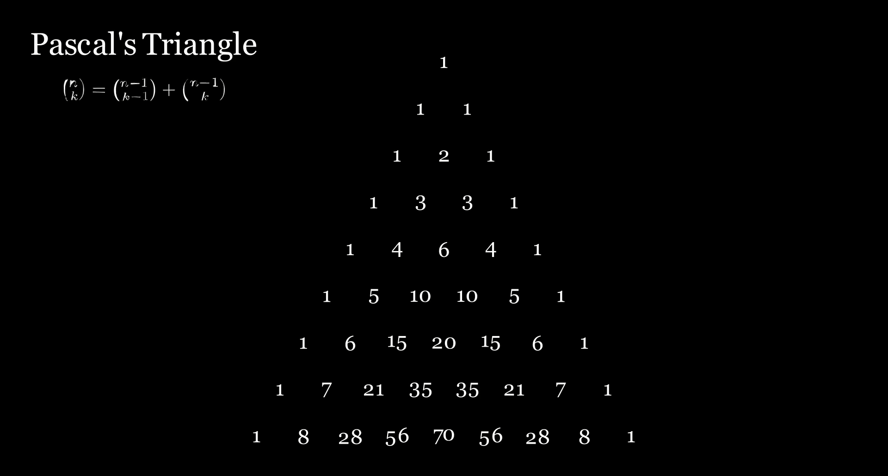

# Pascal's Triangle Animation : made by manim

In this video, we going to see 2 formula about **Pascal's Triangle**, 
which is 
* $\binom{n}{k} = \binom{n-1}{k-1} + \binom{n-1}{k}$ and  
* $\sum_{i=0}^{n} \binom{n}{i} = 2^n$ 

